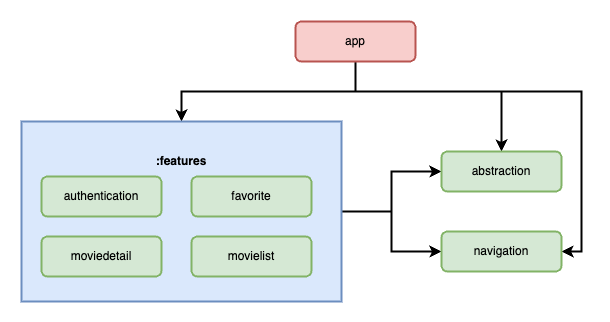

import DogVideo from "../assets/testing.mp4";
import Inline from "$components/inline/Inline";
import Announcement from "$components/announcement/Announcement";


<br></br>
<br></br>

## **Introduction**

As someone who's been working and learning Jetpack Compose, I've found that navigation is a key component of building robust and user-friendly Android apps.
One way to improve navigation is through the use of a bottom navigation bar, which provides easy access to different app features and screens.
Compared to traditional Android UI development with XML, implementing a bottom navigation bar in Jetpack Compose is a unique experience that requires a different approach.

Through my learning, I've discovered some interesting things to work with when
it comes to bottom navigation and Jetpack Compose as a whole. In this article,
I'll walk you through <b>how to implement a dynamic bottom navigation bar in Jetpack Compose</b>, and <b>how to change its behavior based on the user's login status. </b>

<div style={{ display: "flex", justifyContent: "center" }}>
  <video
    controls
    playbackRate={5.0}
    loop
    style={{ width: "30%", height: "auto" }}
  >
    <source src={DogVideo} type="video/mp4" />
  </video>
</div>

<br />

## **Pre-requisites**

This article assumes that you have a basic understanding of <ins>[Jetpack Compose](https://developer.android.com/jetpack/compose?gclid=Cj0KCQjwk7ugBhDIARIsAGuvgPZmt9m6-3A5R38mprSfX7ZDLkAGHJc-j5qoWYxcJsGg9YXn-yCRPf8aAlcFEALw_wcB&gclsrc=aw.ds)</ins> and <ins>[Compose Navigation](https://developer.android.com/jetpack/compose/navigation)</ins>.
If you're new to these concepts, we recommend that you review the official documentation and sample code available on the official websites before continuing.
Having a basic understanding of these concepts will make it easier to follow along with the code snippets and explanations in this article.

To demonstrate the implementation of a dynamic bottom navigation bar, we will use a movie app with TMDB API and multi-module architecture.
The app is structured into multiple modules as shown in the image below:



<br />

## **Tech Stack**

- Jetpack Compose
- Hilt Navigation Compose
- Navigation Compose
- Jetpack Data Store
- Multi Module Architecture

<br />

## **Let's get started**

The app has four main screens: `MovieListScreen` (which is set as the start destination), `MovieDetailScreen`, `FavoriteScreen`, and `AccountScreen`. If the user is not logged in, the bottom navigation bar will only display `MovieListScreen` and `AccountScreen`. However, if the user is logged in, we will add another tab to the bottom navigation bar - `FavoriteScreen`.

```kt file=MainActivity.kt
Scaffold(scaffoldState = scaffoldState,
    bottomBar = {
        BottomNavBar(navController)
    }) { innerPadding ->
    NavHost(
        navController = navController,
        startDestination = MovieListDirections.destination
    ) {
        composable("movieList") {
            MovieListMainView()
        }

        composable("movieDetail") {
            MovieDetailUI()
        }

        composable("favorite") {
            FavoriteUI()
        }

        composable("authentication") {
            AccountScreen()
        }
    }
}
```

In the above code, we register all the Compose screens with the Compose Navigation. We did not add any logic to the `FavoriteScreen`, as there is a problem when the route is loaded before the navigation initialization.
Although we have registered all the screens with the Navigation, it is okay to register screens that have not yet been created, as the traditional Navigation component also follows a <ins>[similar approach](https://developer.android.com/guide/navigation/navigation-design-graph)</ins>.

<br />

## **Login Screen**

Logging in or logging out is a reactive method that triggers a change in the bottom navigation bar. When a user logs in, the `sessionId` will be stored in the Jetpack Compose Data Store.
Otherwise, when the user logs out, the `sessionId` will be removed from the Data Store.

```kt highlights=8,15 file=LoginUseCase.kt
if (loginData is Result.Success) {
    if (!loginData.data.success) {
        emit(Result.Error(Throwable("Fail")))
    } else {
        val createSessionResult = accountRepository.createSessionWithToken(loginData.data.requestToken)
        val sessionId = (createSessionResult as Result.Success).data.sessionId

        assignSessionId(sessionId)

        val accountDetail = accountRepository.getDetailAccount(sessionId)
        emit(accountDetail)
    }
}.flowOn(Dispatchers.IO)

private fun assignSessionId(sessionId: String) {
    runBlocking {
        userSession.setSessionId(sessionId)
    }
}
```

```kt highlights=3 file=AccountViewModel.kt
fun doLogout() {
    viewModelScope.launch {
        userSession.clearSessionId()
        _isLoggedIn.update {
            false
        }
    }
}
```

<Announcement type="asd" className="mt-4">
  Data Store was chosen because it supports <b>flow</b> and{" "}
  <b>asynchronous processes</b>, making it easy to trigger other screens without
  having to create any other Flow or StateFlow. Instead, you can simply use the
  Data Store.
</Announcement>

If you're wondering what `UserSession` is, it's just a wrapper class that contains all the get and read methods from Jetpack Data Store.
It's also injected using Hilt with the `@Singleton` annotation, which means that it will remain active and get the same instance as long as the application is not destroyed.

```kt file=UserSession.kt
@Singleton
class UserSession @Inject constructor(@ApplicationContext private val applicationContext: Context) {

    companion object {
        private val Context.dataStore: DataStore<Preferences> by preferencesDataStore(name = "usersession")
        private val SESSION_ID = stringPreferencesKey("session_id")
    }

    fun getSessionId(): Flow<String> {
        return applicationContext.dataStore.data
            .map { preferences ->
                // No type safety.
                preferences[SESSION_ID] ?: ""
            }
    }

    fun getSessionIdBlocking() = runBlocking {
        getSessionId().first()
    }

    suspend fun setSessionId(sessionId: String) {
        applicationContext.dataStore.edit {
            it[SESSION_ID] = sessionId
        }
    }

    suspend fun clearSessionId() {
        applicationContext.dataStore.edit {
            it.remove(SESSION_ID)
        }
    }

}
```

## **Bottom Navigation Bar**

Now that we have everything set up, it's time to talk about adding a new tab to the bottom navigation bar.
This is actually a fairly simple process once you have a basic understanding of how the Jetpack Compose Navigation library works. Please take a look to this `BottomNavBar` code.

```kt highlights=14,21,22,23 file=BottomNavBar.kt
sealed class Screen(val route: String, val textString: String, val icon: ImageVector) {
    object Home : Screen("movieList", "Home", Icons.Filled.Home)
    object Account : Screen("authentication", "Account", Icons.Filled.AccountBox)
    object Favorite : Screen("favorite", "Favorite", Icons.Filled.Favorite)
}

@Composable
fun BottomNavBar(navController: NavController) {
    val navBackStackEntry by navController.currentBackStackEntryAsState()
    val currentDestination = navBackStackEntry?.destination
    val context = LocalContext.current

    val userSession = UserSession(context)
    val isLoggedIn = userSession.getSessionId().collectAsState("").value.isNotEmpty()

    val items = mutableListOf(
        Screen.Home,
        Screen.Account
    )

    if (isLoggedIn) {
        items.add(1, Screen.Favorite)
    }

    if (items.any { it.route == currentDestination?.route }) {
        BottomNavigation(
            backgroundColor = Color.Gray, contentColor = Color.Black
        ) {
            items.forEach {
                NavigationItem(
                    rowScope = this,
                    icon = it.icon,
                    textString = it.textString,
                    route = it.route,
                    currentDestination = currentDestination,
                    navController = navController
                )
            }
        }
    }
}
```

The concept behind this code is refreshingly simple: within `BottomNavBar`, we retrieve the `UserSession` status through a Flow, and check whether `isLoggedIn` is `true`.
If so, we dynamically add the `Screen.Favorite` item to position 1 - effectively inserting the FavoriteScreen within the `BottomNavBar` when the user is logged in.

Since we're listening to `sessionId` as a Flow, the `BottomNavBar` will automatically <b>recompose</b> as needed.
Thanks to Compose's built-in intelligence, the UI knows exactly when to update itself based on changes to the Flow's value.
Then when the user logs out, it will again trigger recomposition because `isLoggedIn` value change into `false`. Finally, `Screen.Favorite` additions will be ignored.

<br />

## **Conclusion**

In conclusion, creating a dynamic Bottom Navigation with Jetpack Compose is a simple yet powerful way to enhance the user experience of your app. By retrieving the UserSession status as a Flow and updating the Bottom Navigation accordingly, we can ensure that users are presented with a UI that's tailored to their login status - whether they're logged in or out. Additionally, the built-in intelligence of Compose ensures that the UI updates seamlessly and efficiently, resulting in a smooth and responsive app experience.

As we've seen, implementing this functionality is straightforward and requires only a few lines of code. With a little bit of creativity, you can take this concept even further and create a truly personalized UI that adapts to each user's preferences and behavior.
You can get full code here <ans>[Jetpack Compose Movie App Github](https://github.com/yehezkiell/movieapp/tree/dev_hilt_multi_module_compose)</ans>.
