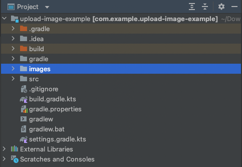
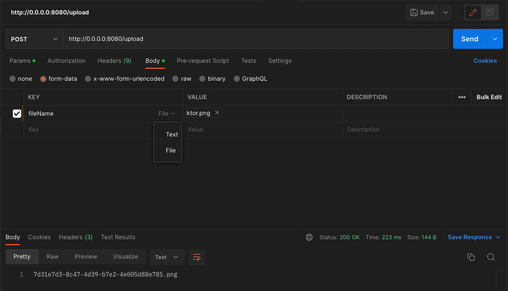
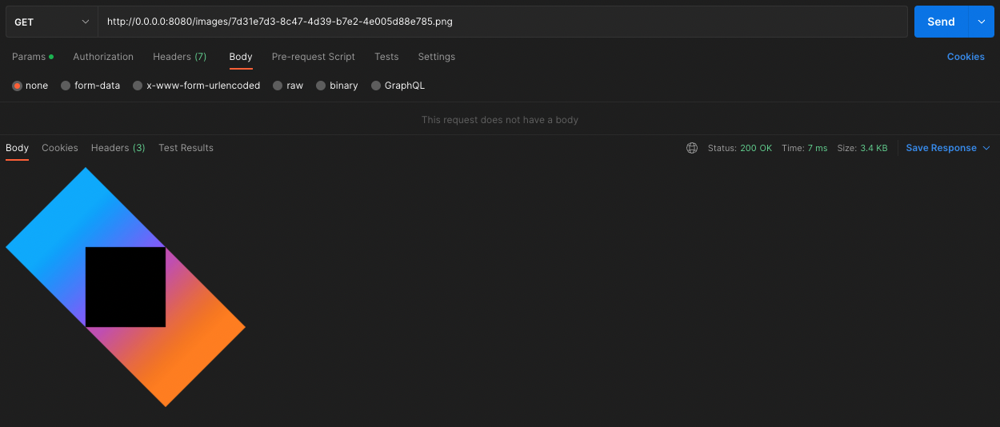

import Announcement from "$components/announcement/Announcement";


<br></br>
<br></br>

## **Introduction**

Hello, fellow learners! Today,
I'm excited to delve into the world of backend media uploaders, inspired by a hobby project that I've collaborated on with two talented engineers, <ins>[Ilham](https://www.linkedin.com/in/ilham-suaib/)</ins> and <ins>[Yovi](https://www.linkedin.com/in/yovi-eka-putra-76036ba2/)</ins>.
In our journey, we encountered a common need: the ability to upload images to our server and then serve them to users via URLs. However, due to <b>budget constraints</b>, we aimed to find a cost-effective solution, avoiding the use of third-party services like AWS S3 or Google Cloud Storage.

Throughout this article, we'll guide you through a simplified approach to achieve this. You'll discover how to efficiently <b>upload images to your server</b> and <b>seamlessly serve them using URLs</b>, all without breaking the bank. So, let's dive into this exciting journey of image handling in the backend!

<br></br>


<br></br>
<br></br>

## **Pre-requisites**

In this article, I won't be offering an in-depth explanation of how Ktor functions or providing a step-by-step guide for creating a project with Ktor from scratch.
You can acquire a solid understanding of these fundamentals by referring to the comprehensive documentation available <ins>[here](https://ktor.io/docs/welcome.html)</ins>.

Instead, I will focus on explaining the concepts and providing simple code examples related to image upload.
While you can expect these examples to work effectively, if you intend to integrate them into your production code, it's crucial to consider various aspects, such as security, code structure, and server memory management.

<Announcement type="asd" className="mt-4">
  If you want to follow steps by steps from this tutorial, you can generate your
  the ktor from{" "}
  <a href="https://start.ktor.io/?_ga=2.106617098.805513190.1696743999-2064556886.1687519137&_gl=1*d5ls6p*_ga*MjA2NDU1Njg4Ni4xNjg3NTE5MTM3*_ga_9J976DJZ68*MTY5Njc0Nzk5MS4zNS4xLjE2OTY3NDgwNzIuNDIuMC4w#/settings?name=ktor-sample&website=example.com&artifact=com.example.ktor-sample&kotlinVersion=1.9.10&ktorVersion=2.3.5&buildSystem=GRADLE_KTS&engine=NETTY&configurationIn=CODE&addSampleCode=true&plugins=">
    Ktor-Generator
  </a>{" "}
  and run it in your IntelliJ IDEA.
</Announcement>

<br></br>

## **Let's Get Started**

We'll divide this tutorial into two sections. The first part covers the more complex task of uploading images as multipart data,
while the second part is a simpler process of serving the uploaded images as responses.

<br></br>

### **1. Upload Image to Server**

When it comes to uploading images to the server, our approach doesn't rely on third-party services or databases.
Instead, we leverage the storage available on either your server machine or your local machine.
To begin, within your Ktor project, create a folder named "images" located in the root directory.
( If you have your own server, you can create this directory wherever you prefer, as long as you have the directory path accessible.)

<br></br>



<br></br>

Then in the future, this folder will be our "Database" to store users images, you got the idea right? Then, we will jump into the coding section, you can define the Route of upload image like :

```kt file=UploadRoute.kt lineNumbers highlights=5,19,20,21,24
fun Route.uploadRoute() {
    post("/upload") {
        runCatching {
            val multipartData = call.receiveMultipart()
            val result = uploadImage(multipartData)

            call.respond(HttpStatusCode.OK, result)
        }.onFailure {
            call.respond(HttpStatusCode.BadRequest, it.message ?: "Something Went Wrong!")
        }
    }
}

private suspend fun uploadImage(multiPartData: MultiPartData): String {
    var fileName = ""
    multiPartData.forEachPart { part ->
        when (part) {
            is PartData.FileItem -> {
                val originalFileName = part.originalFileName
                val extension = originalFileName?.substringAfterLast('.', "")
                fileName = "${UUID.randomUUID()}.$extension"

                val fileBytes = part.streamProvider().readBytes()
                File("$MEDIA_PATH/$fileName").writeBytes(fileBytes)
            }

            else -> {}
        }
        part.dispose()
    }
    return fileName
}
```

Let's dive deeper into the critical lines of the code:

- **Line 5**: This line is where we start processing incoming multipart data, commonly used for file uploads.
- **Lines 19-21**: In this part, we gather important details about the uploaded image, like its size and format. We also create a unique name for the image, so each one has its own special identifier.
  To make sure these identifiers are truly unique and avoid any duplicates when we share the URLs with users, we use Random UUIDs (Universally Unique Identifiers). This way, every image gets a unique ID, ensuring there are no conflicts.
- **Line 24**: Finally, we store the actual image data as bytes in a pre-created media folder. This step ensures the secure storage of the uploaded image for future use in our application.

That's it! We've successfully implemented image uploads to the server and stored them in the "images" folder.
But wait, there's one last thing on our to-do list. We don't want users sneaking in hefty images, right? After all, we're watching our budget like a hawk, and colossal images could blow it wide open!
Then, we need to check the size of the image, in this example I'll limit the size to 2Mb.

```kt file=UploadRoute.kt lineNumbers highlights=3,4,7,8,9
fun Route.uploadRoute() {
    post("/upload") {
        val contentLength = call.request.header(HttpHeaders.ContentLength)
        val maxFileSizeBytes = 1.5 * 1024 * 1024 // 1.5 MB in bytes

        runCatching {
            if (contentLength!!.toInt() > maxFileSizeBytes) {
                call.respond(HttpStatusCode.BadRequest, "File size exceeds 2 MB limit.")
                return@runCatching
            }

            val multipartData = call.receiveMultipart()
            val result = uploadImage(multipartData)

            call.respond(HttpStatusCode.OK, result)
        }.onFailure {
            call.respond(HttpStatusCode.BadRequest, it.message ?: "Something Went Wrong")
        }
    }
}
```

Finally, add this new route into the main Route configuration:

```kt file=MainRoute.kt lineNumbers highlights=7
fun Application.configureRouting() {
    routing {
        get("/") {
            call.respondText("Hello World!")
        }

        mediaRoute()
    }
}
```

Voila! We're locked and loaded. Now, it's time to fire up your Ktor server and let's give our image uploading masterpiece a spin in Postman. Get ready to witness it in action!

To test it in Postman, set up your request body with the following configuration:

<br></br>



<br></br>

<Announcement type="asd" className="mt-4">
  Indeed, as you can observe, our current setup returns just the name of the
  image. However, we aim to make this process more dynamic. This way, we can
  effortlessly switch the main URL to whatever suits our needs, be it staging,
  production, or any other environment of our choosing. Flexibility and
  adaptability at their finest!

Sure, when it comes to the production code, it's important to use the response format that everyone agreed on. This helps keep things organized and ensures that the user experience stays consistent and meets the standards we've set. It makes the application look professional and dependable.

</Announcement>

### **2. Serve Image to User**

You've got it! After gathering all the images, our next move is to provide users with easy access through unique URLs.
To achieve this, we'll create an additional route using the HTTP `GET` method, and here's the code snippet for that:

```kt file=MediaRoute.kt lineNumbers highlights=4,5
fun Route.mediaRoute() {
    get("/images/{fileName}") {
        val fileName = call.parameters["fileName"] ?: throw IllegalArgumentException("Missing parameter: fileName")
        val imagePath = "$MEDIA_PATH/$fileName"
        val imageFile = File(imagePath)
        if (imageFile.exists()) {
            call.respond(LocalFileContent(imageFile))
        } else {
            call.respond(HttpStatusCode.NotFound)
        }
    }
}
```

Then don't forget to add `uploadRoute` into our main Route configuration:

```kt file=MainRoute.kt lineNumbers highlights=8
fun Application.configureRouting() {
    routing {
        get("/") {
            call.respondText("Hello World!")
        }

        mediaRoute()
        uploadRoute()
    }
}
```

As you can see in the highlighted code above, we extract the `fileName` and retrieve the corresponding image from the previously established "images" folder. Now, let's put our image URLs to the test in Postman:

<br></br>



<br></br>

## **Conclusion**

Indeed, it's quite straightforward, isn't it? So, in summary, for handling media uploads on your server, this approach is an excellent choice, especially for smaller or hobby projects. However, if you're running a large-scale production app with a substantial user base and the financial means, it's wise to explore third-party services like AWS S3 or Google Cloud Storage.
Oh, and remember to tighten the security belt by implementing proper authorization when uploading images.

Furthermore, don't forget about your global fans – toss in a Content Delivery Network (CDN) to serve them well! While our simple approach is a champ for the little guys, taking on the big leagues might need those fancy services and setups.
